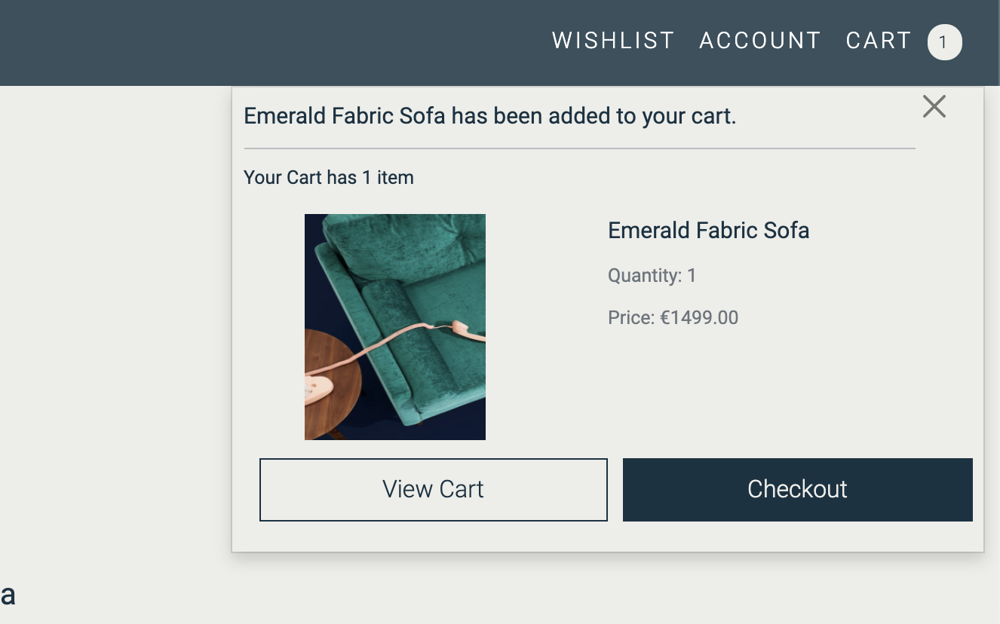

# Abode Furniture E-Commerce Store

## Milestone Project 4

- This project aims to build a full-stack web application using Django full-stack web framework, HTML, Css3 and javascript.

  - I have built an e-commerce web application for a fictional furniture company.
  
  - My application features e-commerce functionality, payments using stripe, a blog section, user login using Facebook, a wishlist section for registered users, confirmation emails, CRUD functionality for admin to add blog posts and stock items, and an admin section, for the admin user to access database records.

  - For the assessor, I have included the admin login details in the comments section when submitting the project.

  - This website is for educational purposes and the stripe functionality is set up to accept the test card details please don't enter your personal card details. 
  
     - To use the stripe function use the following details.

        - card number : 4242 4242 4242 4242
        - Any date
        - Any CVV number.


## Live project


- [View the live project here.](https://abode-milestone-4.herokuapp.com/)

## Screenshots

  - ### Landing page Hero Section.

<div align="center"></div>

  - ### Landing page Shop Our Collections.

<div align="center"></div>

## Table of Contents.

- [User experience](#user-experience)
  * [User Stories](#user-stories)
  * [WireFrames](#wireframes)
  * [Database models and schema](#database-models-and-schema)
    + [Models](#models)
  * [Design](#design)
    + [Colour scheme](#colour-scheme)
    + [Typography](#typography)
    + [Images](#images)
    + [Icons](#icons)
- [Features](#features)
    + [Homepage App.](#homepage-app)
    + [Stock App](#stock-app)
    + [Cart App.](#cart-app)
    + [Checkout app.](#checkout-app)
    + [Reviews app.](#reviews-app)
    + [Users app.](#users-app)
    + [Wishlist app.](#wishlist-app)
    + [Blog app.](#blog-app)
- [Testing](#testing)
    + [Testing.](#testing)
- [Technologies used.](#technologies-used)
  * [Languages Used.](#languages-used)
  * [Django, and Django extensions used](#django--and-django-extensions-used)
  * [Frameworks Libraries and Programs.](#frameworks-libraries-and-programs)
  * [Deployment.](#deployment)
    + [Github, Gitpod, Git, Heroku, and Amazon AWS.](#github--gitpod--git--heroku--and-amazon-aws)
    + [Project setup.](#project-setup)
    + [Deployment to Heroku](#deployment-to-heroku)
    + [Amazon AWS](#amazon-aws)
    + [Setting up locally](#setting-up-locally)
- [Credits.](#credits)
  * [Code.](#code)
    + [Kevin Powell Youtube video.](#kevin-powell-youtube-video)
    + [The WebShala Thumbnail slider](#the-webshala-thumbnail-slider)
    + [Stack Overflow](#stack-overflow)
  * [Content](#content)
  * [Media](#media)
  * [Acknowledgements](#acknowledgements)

<small><i><a href='http://ecotrust-canada.github.io/markdown-toc/'>Table of contents generated with markdown-toc</a></i></small>


## User experience

### User Stories

- Customers
  - Website experience
    - As a customer, I would like to see what the website is selling.
    - As a customer, I would like to be able to navigate the website easily.
    - As a customer, I would like to see some information about the company.
    - As a customer, I would like to be able to contact the company.
  
  - Searching for items.
    - As a customer, I would like to see all the products the company sells.
    - As a customer, I would like to be able to search by category.
    - As a customer, I would like to be able to search through the items.
    - As a customer, I would like to sort the items by price.

  - Shopping.
    - As a customer, I would like to see the product price and description.
    - As a customer, I would like to be able to add products to my shopping cart.
    - As a customer, I would like to be notified when I complete interactions with the site.
    - As a customer, I would like to be able to edit my shopping cart.
    - As a customer, I would like to be able to checkout easily.
    - As a customer, I would like to receive confirmation of my order.

  - Account.
    - As a customer, I would like to save my details to an account.
    - As a customer, I would like to see my previous order details.
    - As a customer, I would like to leave a review of the company.

- Website owner.
  - As the business owner, I would like to be able to edit and add products easily.
  - As the business owner, I would like to be able to delete products.
  - As the business owner, I would like to have access to an admin section. 
  - As the business owner, I would like my customers to be able to shop on the site easily.


### WireFrames

- I've created WireFrames using Balsamiq and have included the links to access them in pdf form.

  - Phone
    - [Wireframes for phones.](readme-images/wireframes/milestone4-mobile-wireframes.pdf)
  - Tablet
    - [Wireframes for tablets.](readme-images/wireframes/milestone4-tablet-wireframes.pdf)
  - Desktop
    - [Wireframes for desktops.](readme-images/wireframes/milestone4-desktop-wireframes.pdf)

### Database models and schema

- #### Models
- Users
  - User
    - From Django Allauth containing the username, email, and password.
  - Userprofile
    - Model containing the user's details for future orders.
  - Wishlist
    - Contains a list of items that the user has liked.

- Stock 
  - Items
    - Contains the stock information for each stock item.
  - Categories
    - The categoriesfor the stock items.

- Customer details.
  - Newsletter Subscribers
    - Contains the email of users who have signed up for the newsletter.
  - Messages.
    - Contains the details of the messages from the contact form.

- Shop
  - Order
    - Contains details of the customer's orders, their details, and the items they've ordered.
  - Orderline item
    - Items for the customer order the quantity and total.

- Blog
  - Post
    - Contains the blog post and details of its author and title.
  - Comments
    - Contains the comments for each post.


- Database Diagram

  - The database diagram shows a list of items in each object and relationships between each object.

    <div align="center"></div>

### Design

- #### Colour scheme

  - My Colour scheme was inspired by my main hero image matching the navy background within the image to be used for the navigation and text colour.
  - I then pick two complementary grey colours for the main background throughout the site, alternating between them in places to clearly define sections.
  - Throughout the site, I used different opacities of these colours to create a softer pallet.

    - <p align="center"></p>

- #### Typography

  - I've chosen the Roboto font from google fonts for my site.
  - I've used the one font throughout the website to keep the design consistent.
  - I then used different font weights to add more emphasis to some text, such as headings. 
    - <p align="center"></p>

- #### Images 

  - Images are a key part of this site. 
  - All the images I have used were obtained from Unsplash.
  - I've used two main hero images on the landing page to give the site a dramatic appearance upon opening.
  - I then found images of furniture items and lighting items which I used to create my stock items for the e-commerce part of the site.

- #### Icons 
  - I've used icons in this project for the navigation on mobile sites and the social media links in the footer.
  - All icons have been obtained from Line Awsome.

## Features
  
- #### Homepage App.

    - Hero Section.
        - Upon opening the site the user is greeted with the main hero section the clearly defines the site as a furniture store. 
        - There are also links to shop the collection or to visit the Our Story page.
            - <p align="center"></p>
        
    - Interactive Nav

        - The site then contains the navigation section accessed by clicking on the hamburger icon.
        - The navigation is then animated to slide in from the left with a slight delay on each nav item so they slide in one after the other.
        - The navigation also has an opaque background and a slight background blur to give it a modern glass feel.
            - <p align="center"></p>
        
    - New Items.

        - The new items section contains a slider controlled by left and right arrows containing the stock in the new items category.
        - The user can click on the arrows to navigate through the slider.
            - <p align="center"></p>
        
    - Newsletter

        - The homepage contains a section where the user can sign up for a newsletter.
        - Their email address will then be stored in the database and they will be sent a confirmation email.
            - <p align="center"></p>
        
    - Blog

        - The blog section shows the last three post that were added to the blog.
        - The user can then click on the items and be led to the blog post.
        - There is also a button to lead to the main blog page also.
            - <p align="center"></p>
        
    - Contact

        - The footer section contains the contact details for the company and the social media links.
        - There is also a link to a contact us form.
        - Once submitted the message will be saved in the database where the admin can see it and the user is redirected back to the home page and a message is shown to alert them their message has been sent.
            - <p align="center"></p>
        
    - Our Story Page.
        - The Our Story page has a few short bullet points and images telling the user about the company and its values.
            - <p align="center"></p>

- #### Stock App

    - All Items 
        - The all items view shows all the items available in the store.
        - Then navigation has links to each category of items such as chairs, lighting and sofas etc.
            - <p align="center"></p>
    
    - Items sort.
        - The user can then sort through the items by using the select input at the top of this section.
            - <p align="center"></p>

    - Items Pagination
        - This section also has a pagination function it will show up to 6 items at a time and then let the user know how many pages there are.
            -  <p align="center"></p>

    - Item page.
        - The item page then consists of the items details with a quantity selector and an add to cart button.
        - It also has a link back to the items page so the user can continue shopping.
        - If the user isn't signed up or logged in a notification at the bottom of this section is shown that lets the user know if they sign in they can create a wish list, with links to the signup or login page.
            -  <p align="center"></p>

    - Superuser.
        - If the user is a superuser the item page will contain links to the edit page or to delete the item.
            -  <p align="center"></p>

        - If the user selects to delete the item a modal will show to confirm this action to prevent accidental deletion.
            -  <p align="center"></p>

        - The superuser will also have access to the stock control page to add items from the account navigation.
            -  <p align="center"></p>

- #### Cart App.
    - Add to Cart.
        - The user has the option to add items to the cart from the item page.
        - When the user clicks this button the item will be placed into the cart. 
        - The user will then be shown a message showing that the item has been placed in the cart with a list of cart items.
        - The user can then view their car of checkout from this message also.
        - The cart navigation item will then show a button showing the number of items in the user's cart.
            -  <p align="center"></p>
    
    - Cart Page.
        - The cart page then shows the users the items in their cart.
        - The user can then adjust the quantity of each item, or delete the item from the cart.
        - The cart also shows the total price with delivery to the user.
        - If the user is happy with the cart there is a link to the checkout  page
        - If the user wishes to continue shopping there is a link to the items page.
            -  <p align="center"></p>
        

- #### Checkout app.
    - Checkout page.
        - Once the user is happy with their cart they can go to the checkout page.
        - Here they are shown the checkout form and a list of their cart items with thee the total amount.
            -  <p align="center"></p>
    
    - Order confirmation page.
        - Once the order has been confirmed the user is then directed to the order confirmation page.
        - The user is then shown the order details and order number.
        - A confirmation email will also be sent to the user.
            -  <p align="center"></p>

- #### Reviews app.
    - Reviews page.
        - From the reviews section in the user can navigate to the review page.
        - Here they can see a list of reviews users have left.
        - If they aren't logged in they will see a notification to log in or sign up to leave a review, with links to the login and signup pages.
            - <p align="center"></p>
        
        - If the user is logged in they will see a form section to leave a review.
        - Once the form is submitted it will appear in the reviews section.
        - If the current user is the author of a review they will be given the option to edit or delete the review.
        - The admin can also delete a review from the backend in the case someone has entered inappropriate content.
            -  <p align="center"></p>

- #### Users app.
    - Account 
        - The navigation has a link to the user's account which will change depending on the users status.
            -  <p align="center"></p>
    
    - Signup 
        - If the user isn't signed up they can click the signup link and be brought to the signup page.
        - Here they can fill in the signup form to signup.
        - The page also has a link to the login in case a user has navigated here who has already been signed up.
            -  <p align="center"></p>
    
    - Login
        - Once the user has been signed up they can now use the login feature.
        - They can fill out their login details or use the login with the Facebook link.
        - There is also a link to the signup form in case a user has navigated here who hasn't signed up yet.
            -  <p align="center"></p>
    
    - Profile page.
        - The user's profile page will hold the users shipping details for ease of shopping in future.
        - It also has a reference to the users past orders.
            -  <p align="center"></p>

        - When the user clicks on the order number, they are then brought to that previous order page which shows the details of this previous order.
            -  <p align="center"></p>

- #### Wishlist app.
    - Add items.
        - The wishlist feature is for logged in users only. On the item page, the users are asked to log in or sign up to create a wishlist, also the wishlist page will prompt them to login or signup if they aren't.
        - To add an item to the wishlist the user can click on the like button on the item image from the all items page or the items page.
        - Once they click on this button they will receive a message to say the item has been added to their wishlist.
        - The button will then change colour to show the item is on the user's wishlist.
            - Item before the click.
            - <p align="center"></p>
            - Item after the click.
            - <p align="center"></p>
    
    - Wishlist page.
        - The user can then navigate to the wishlist page where the list of the like items will be shown.
        - Each item will have an add to cart button so the user can add it to their cart directly from the wishlist.
            - <p align="center"></p>
    
    - Edit wishlist.
        - To edit the wishlist the user can click the edit button which then shows the edit buttons to the user.
        - The user can also click the delete button to delete the whole wishlist.
        - If they click delete they will be asked to confirm this with a modal popup.
            - <p align="center"></p>

- #### Blog app.
    - View blog.
        - The main blog page shows all the recent blog post.
            - <p align="center"></p>

        - When a user selects the post they are brought to the main blog post page.
            - <p align="center"></p>

        - There is also a comment section for logged in users on each blog post.
    
    - Blog add post and edit
        - The front end consists of an add blog post page and an edit page that is made available to superusers only.
            - <p align="center"></p>

## Testing

- #### Testing.
  - The testing section for this site is located at the following link.
    - [Testing file](TESTING.md)

## Technologies used.

- The application was built on the Django full-stack framework.
- For each section of the site a Django app was created.
- Each app then has a views.py, urls.py file to create the pages it needs.
- Then to create the database models a models.py file is used.
- If there are any forms needed they are then created in the forms.py file.
- Stripe has been used for the payment function of the e-commerce shop.
- Heroku was used to deploy the application.
- Amazon AWS was used to store. the static files and the image files.

### Languages Used.

- [HTML5](https://en.wikipedia.org/wiki/HTML5)

  - HTML5 was used to create the content and base of each page.

- [CSS3](https://en.wikipedia.org/wiki/CSS)

  - CSS3 was used to then style the page and make it responsive through media queries, and interactive through using CSS transitions.

- [javaScript](https://en.wikipedia.org/wiki/JavaScript)
  - javaScript was used throughout the website to make the site interactive.

- [Python](https://en.wikipedia.org/wiki/Python_(programming_language))
  - Python was used to build the backend functionality of the web app.

### Django and Django extensions used

- [Django](https://www.djangoproject.com/)
  - Django was used to create the project.

- [Django Allauth](https://django-allauth.readthedocs.io/en/latest/)
  - Django allauth was used to create the user sign-in function for the site.

- [Django Allauth Social Login](https://django-allauth.readthedocs.io/en/latest/providers.html/)
  - Django allauth Social login function was used to allow the user to sign up, or log in with Facebook.

- [Django Countries](https://pypi.org/project/django-countries/)
  - Django Countries was used for the countries select field in the order form.

- [Django Crispy Forms](https://django-crispy-forms.readthedocs.io/en/latest/)
  - Django Crispy Forms were used to utilise the bootstrap form classes.

- [Django Coverage](https://pypi.org/project/django-coverage/)

  - Django Coverage was used when testing to form a testing report.


### Frameworks Libraries and Programs.

- [Stripe](https://stripe.com/ie)

  - CStripe has been used for the payment section of the site.

- [Heroku](https://signup.heroku.com/)

  - Heroku was used to deploy the website.

- [Amazon AWS](https://aws.amazon.com/)

  - Amazon AWS was used to store the static files and the images for the site.

- [Facebook](https://developers.facebook.com/)

  - Facebook was used for allauth social sign-up and login.


- [Gunicorn](https://gunicorn.org/)

  - Gunicorn was used for deploying the project to Heroku.

- [Google Fonts](https://fonts.google.com/)

  - I imported the Mulish font from google fonts and used it consistently across the site.

- [Line awesome](https://icons8.com/line-awesome)

  - I used different icons from Line awesome for icons in the application.

- [Bootstrap 5](https://getbootstrap.com/)

  - Bootstrap 5 was used for its grid system and its form inputs and its helper classes.

- [Quick Database Diagrams](https://www.quickdatabasediagrams.com/)

  - I used quick database diagrams to make a diagram of my database schema.

- [Git](https://git-scm.com/)

  - Git was used as a version control in the terminal.

- [Github](https://github.com/)

  - Github was used to create and store the project repository.

- [Gitpod](https://gitpod.io/)

  - Gitpod was used to create my files and code the project.

- [Balsamiq](https://balsamiq.com/)

  - Balsamiq was used to create Wireframes for the project during the initial planning stage.

- [Am I responsive](http://ami.responsivedesign.is/)

  - Am I responsive was used to taking screenshots of the page at different screen sizes.

- [Markdown toc](http://ecotrust-canada.github.io/markdown-toc/)

  - Markdown toc was used to create my table of contents.


### Deployment.

#### Github, Gitpod, Git, Heroku, and Amazon AWS.

- #### Project setup.
 - The project was set up on GitHub using the Code Institue Gitpod Template.
  - I located the template on the Code Institute GitHub page and clicked the use template button.
  - I then named my repository and created it.
  - Once the repository was created I was able to open it with Gitpod.
  - I could then use the terminal to create files and folders and start coding the project.
  - Throughout the project, I used git to add my changes to version control in GitHub.
  - To commit I added the file to the staging area with the 
    ```
        git add <filename>
    ```
    ```
        git commit -m "<commit message>"
    ```
    ```
        git push
    ```
 
- #### Deployment to Heroku

  Once the app was ready I deployed it to Heroku by following these steps.

- **Create an app on the Heroku website.**
    - Firstly I clicked on the new button.
    - Then I clicked on the create a new app.
    - I then gave my app a name and chose my current region.
    - I then selected create app.

- **Set up Postgres Database**
  - Heroku
    - In the app resources section I searched for Postgres
    - I then chose to add to the project and, choosing the free plan.
    - To use Postgres we need to install 2 dependencies.
        - dj_database_url
        - psycopg2

  - **In Project.**
    - I first installed the two packages needed 

    - 
        ``` 
            pip3 install dj_database_url
        ```
    -
        ```
            pip3 install psycopg2_binary
        ```

    - I then made sure to add them to the requirements.txt file
    -
        ```
        pip3 freeze > requirements.txt
        ```
    - Then in settings.py I imported dj_database_url
    - 
        ``` python
        import dj_database_url
        ```
    - I then commented out the current database settings.
    - I then replaced it with the settings for the Postgres database.
    -
        ``` python
            DATABASES = {
                'default': dj_database_url.parse('DATABASE_URL')
            }
        ```
    - Get your database URL from your app config settings. (I haven't shown it above as its and environmental variable and shouldn't be shown in version control)

    - Once this is set up we need to migrate our models to the new database.
    - 
        ``` 
            python3 manage.py migrate
        ```

    - I then used the fixtures I had to create earlier to add the stock into the new database. 
    - 
        ```
            python3 manage.py loaddata categories
            python3 manage.py loaddata stock
        ```

    - Once this was done I then created a superuser.
    - 
        ```
            python3 manage.py createsuperuser
        ```
    
    - I then committed my changes making sure to remove my database URL beforehand so it isn't saved in version control.

    - I then created an if-else statement in the settings.py to use Postgres if the DATABASE_URL variable is available and if not use the default database

    - 
        ``` python
            if "DATABASE_URL" in os.environ:
                DATABASES = {
                    "default": dj_database_url.parse(os.environ.get('DATABASE_URL'))
                }
            else:
                DATABASES = {
                    'default': {
                        'ENGINE': 'django.db.backends.sqlite3',
                        'NAME': BASE_DIR / 'db.sqlite3',
                    }
                }
        ```
    
    -The Postgres database is now ready for use.

  - **Gunicorn**
    - For our app to work we need to install Greenunicorn.
    - To install 
    - 
        ```
        pip3 install Gunicorn
        ```
    - We then need to create a Procfile to let Heroku know how to run the app.
    -
        ``` 
            touch Procfile
        ```
    - Then in our Procfile place the following code.
    -
        ```
            web: gunicorn <app name>.wsgi:application
        ```

  - **Heroku in the command line.**
    - I then logged into Heroku using the terminal.
    -
        ```
            heroku login -i
        ```
    - Then I temporarily disabled the static files until they have been set up on Amazon Aws.
    -
        ```
            heroku config:set DISABLE_COLLECTSTATIC=1 --app <app name>
        ```
        - Use the --app command if you have more than one Heroku app.
    - Then in settings I added Heroku into allowed hosts, and localhost so my project can still be run locally.
    -
        ``` python
            ALLOWED_HOSTS = ["<heroku app name>.herokuapp.com", "localhost"]
        ```
    - My changes were then committed to Github.
    - Then I set up pushing to Heroku
    -
        ```
            heroku git:remote -a <heroku app name>
        ```
    - Then we push the project to Heroku
    -
        ```
            git push heroku master
        ```

    - Heroku will now build your app.

  - **Heroku Website**

    - I then connected my app to GitHub by opening the Deploy section.
    - I then searched for my repository.
    - Once found I connected and then enabled Automatic Deploys
    - This now means that any changes pushed to GitHub will be automatically pushed to Heroku as well.

- #### Amazon AWS

  - Amazon AWS was used to store both static files and media files.
  - Firstly I created an AWS account and worked through the sign-up process. Once my account was set up I was able to set my project up on AWS.

  - **Create a bucket.**

    - Create the bucket
        - First thing was to create a new bucket on the AWS S£ service.
        - From the main dashboard search for S£ and then click to get started.
        - Click on the Create bucket button.
        - Give the bucket a name and select your region.
        - Then uncheck the block public access and acknowledge that the bucket will now be public.
        - Then click create bucket.
    
    - Bucket settings.
        - Properties
            - Navigate to the bucket properties settings.
            - Turn on static website hosting.
            - In the index and error add index.html and error.html.
            - Click Save.
        - Permissions
            - Click on the buckets Permissions tabs.
            - Firstly paste in the following cors config.
            - 
                ```
                [
                    {
                        "AllowedHeaders": [
                            "Authorization"
                        ],
                        "AllowedMethods": [
                            "GET"
                        ],
                        "AllowedOrigins": [
                            "*"
                        ],
                        "ExposeHeaders": []
                    }
                    ]
                ```
            - Then in the bucket policy tap, click on generate policy.
            - Policy
            - Select S3 bucket policy
            - Add * to the principal field to select all principals
            - Set the action to get object.
            - Paste in your ARN which is available on the previous page.
            - Click, add statement
            - Then click, generate policy.
            - Now copy and paste your new policy into the bucket policy.
            - Add /* onto the end of the resources key
            - Click Save.
        - Access control list
        - In the access control list tab set the list objects permission to everyone.
    
   - **Create a User.**

     - To create a user for the bucket we need to use another Amazon service.
     - Back in the main dashboard search for IAM and select it.
     
     - Create a Group.
       - Firstly we need to create a group to put our user in.
       - Click create a new group and name it.
       - Click through to the end and save the group.
       - Create a policy.
         - In our group click, policy and then, create policy.
         - Select the JSON tab and then import managed policies.
         - Search S3 and select AmazonS3FullAccess and import.
         - In the resources section paste in our arn from before.
         - click through to review the policy.
         - Fill in name and description and then click generate policy.
       - Back in your group click permission and then attach the policy.
       - Find the policy you've just created and attach it.
    
     - Create the User.
       - Select Users from the sidebar and then click, add user.
       - Create a user name and select programmatic access then click next.
       - Then select your group to add your user to.
       - Click through to the end and then click create user.
       - ** Make sure to now download the CSV file as it contains the users keys needed to access from our app.**

  - **Connecting to Django**
    
    - Once our AWS has been set up we now need to connect it to Django.
    - Firstly two packages are needed.
      - boto 3
      - Django storages
    - Firstly install these packages.
    -
        ```
            pip3 install boto3
            pip3 install django-storages
        ```
    - Then add to our requirements.
    -
        ```
            pip3 freeze > requirements.txt
        ```
    - We then add storages into our installed apps in settings.py
    - We then add the following settings to our settings.py
    - We create an environmental variable to only run this code when on Heroku. "USE_AWS"
    -
        ``` python
            if "USE_AWS" in os.environ:

                # Bucket Config
                AWS_STORAGE_BUCKET_NAME = '<bucket name>'
                AWS_S3_REGION_NAME = '<your region>'
                AWS_ACCESS_KEY_ID = os.environ.get('AWS_ACCESS_KEY_ID')
                AWS_SECRET_ACCESS_KEY = os.environ.get('AWS_SECRET_ACCESS_KEY')
                AWS_S3_CUSTOM_DOMAIN = f'{AWS_STORAGE_BUCKET_NAME}.s3.amazonaws.com'

                # static and media file storage
                STATICFILES_STORAGE = 'custom_storages.StaticStorage'
                STATICFILES_LOCATION = 'static'
                DEFAULT_FILE_STORAGE = 'custom_storages.MediaStorage'
                MEDIAFILES_LOCATION = 'media'

                # Override static and media URLs in production
                STATIC_URL = f'https://{AWS_S3_CUSTOM_DOMAIN}/{STATICFILES_LOCATION}/'
                MEDIA_URL = f'https://{AWS_S3_CUSTOM_DOMAIN}/{MEDIAFILES_LOCATION}/'
        ```
    - Then back in Heroku we click the settings and reveal config vars.
    - Then set up the environmental variables needed.
    - We then create a custom_storages.py to tell Django that in production we want to use s3 to store our static and media files.
    - We Firstly need to import S3Boto3Storage.
    - then we set up our new classes to tell Django where to store the files.
    -
        ``` python
            class StaticStorage(S3Boto3Storage):
                location = settings.STATICFILES_LOCATION


            class MediaStorage(S3Boto3Storage):
                location = settings.MEDIAFILES_LOCATION
        ```
    - Once all the settings are done we can now push to GitHub and Heroku.

  - **Add our media to AWS.**
  
    - The final step is to add our media to AWS.
    - In your bucket create a new folder called media.
    - Select upload and add your image files.
    - Then select to grant public access.
    - And then upload the files.

#### Setting up locally

  - To set the project up locally you can follow these steps.
    
    - Download a copy of the repository from Github using the Download Zip option in the code dropdown.

      - <p align="center"></p>
    
    - Then extract the zip file to your repository.

    - Alternatively, you can clone it into your repository using the following command.

      - ```
            git clone https://github.com/BrianWhelanDublin/milestone-project-4.git
        ```
    
    - Once you have created the repository you can now download the requirements by running the following command.

      - 
      ```
            pip3 install -r requirements.txt
      ```
    
    - You must then set up the following environment variables to use the full functionality of the site.

      - DANGO_SECRET_KEY = your secret key.
      - STRIPE_PUBLIC_KEY = your stripe public key.
      - STRIPE_SECRET_KEY = your stripe secret key.
      - STRIPE_WEBHOOK_SECRET = your stripe webhook secret.
      - IN_DEVELOPMENT = True

      - Your stripe variables can be found on your stripe dashboard.
      - You can generate a Django secret key here. [Django Secret Key Generator](https://miniwebtool.com/django-secret-key-generator/)
    
    - You will then need to migrate the database models to set up your database.
    - 
      - Check first
        ```
            python3 manage.py makemigrations --dry-run
        ```
       -  Then make migrations.
            ```
                python3 manage.py makemigrations
            ```
       - Check the migration plan
            ```
                python3 manage.py migrate --plan
            ```
       - Then finally migrate
            ```
                python3 manage.py migrate
            ```

     - Then create your superuser to access the admin section.
      -
        ```
            python3 manage.py createsuperuser
        ```

        - Following the prompts.

    - Once these steps have been followed you can then run the project by using the following command.

        - 
            ```
                python3 manage.py runserver
            ```

## Credits.

### Code.

- #### Kevin Powell Youtube video.
    - [Fade + slide in nav list items one at a time](https://www.youtube.com/watch?v=xkKjrH3pRfg&list=WL&index=3&t=1028s)
        - This youtube walkthrough help me to design and animate my navigation menu. I've adapted the code to suit my site.

- #### The WebShala Thumbnail slider
    - [Responsive Thumbnail Slider using by Html Css Javascript](https://www.youtube.com/watch?v=Gi4CTYOs7J4&t=842s)
        - This youtube walkthrough help me with my new items slider on the homepage.

- #### Stack Overflow 

    - [Sending POST data with fetch](https://stackoverflow.com/questions/6396101/pure-javascript-send-post-data-without-a-form)
        - I used code from the above StackOverflow article to help with sending post data using fetch in javascript.

    - [Django CSRF](https://stackoverflow.com/questions/43606056/proper-django-csrf-validation-using-fetch-post-request)
        - I used code from this stack overflow article to help with the Django CSRF validation when using fetch and post. 

    - [Removing Blue Background in forms](https://stackoverflow.com/questions/55131944/how-to-remove-blue-background-on-chrome-autocomplete)
        - I used code from the above article to remove the light blue background that chrome was putting on my forms. 

    - [Error with the decimal fields](https://stackoverflow.com/questions/56458774/django-error-class-decimal-invalidoperation)
        - I used code from the above article to help with a bug during development with my decimal fields.

    - [Messages extra tags](https://stackoverflow.com/questions/15017706/how-to-display-multiple-django-messages-in-one-page)
        - I used the above article to help with only showing the cart items with some successful messages.

    - [Test image input in Django forms](https://gist.github.com/drillbits/5432699)
        - I used this code to help with my Django testing of the forms image input.

    - [Django allauth Facebook](https://dev.to/gajesh/the-complete-django-allauth-guide-la3)
        - I used this article to help set up the allauth Facebook signup.


### Content

- All Text for the website was written by myself.

### Media

- [Unsplash](https://unsplash.com/)
    - All images for the website were obtained from Unsplash.

### Acknowledgements

- Code Institute for getting me to this point

- My Mentor Spencer for his help with this project.
