# Testing 

## Table of contents.

- [User Stories.](#user-stories)
- [Unit Testing](#unit-testing)
  * [Django Unit Testing](#django-unit-testing)
- [Test and Bugs During Development](#test-and-bugs-during-development)
    + [Posting Data in the Cart App.](#posting-data-in-the-cart-app)
    + [Moving Fetch function into its own file.](#moving-fetch-function-into-its-own-file)
    + [Post Data in the Stripe js](#post-data-in-the-stripe-js)
    + [Blue background in forms on google chrome.](#blue-background-in-forms-on-google-chrome)
    + [Error With Decimal Fields.](#error-with-decimal-fields)
- [Defensive Programming and Security](#defensive-programming-and-security)
  * [Defensive Programming.](#defensive-programming)
- [Manual Testing](#manual-testing)
    + [Cart Functionality.](#cart-functionality)
    + [Checkout Functionality](#checkout-functionality)
    + [Stock control](#stock-control)
    + [Reviews Functionality.](#reviews-functionality)
    + [Blog Functionality](#blog-functionality)
    + [Wishlist Functionality](#wishlist-functionality)
    + [Newsletter Sign up](#newsletter-sign-up)
    + [Contact Form](#contact-form)
    + [Forms](#forms)
    + [Facebook Login.](#facebook-login)
- [Validators](#validators)
    + [CSS](#css)
    + [Javascript](#javascript)
    + [Python](#python)
    + [Html](#html)
- [Responsiveness and Browsers](#responsiveness-and-browsers)
- [Accessibility](#accessibility)

<small><i><a href='http://ecotrust-canada.github.io/markdown-toc/'>Table of contents generated with markdown-toc</a></i></small>


## User Stories.

- Customers
  - Website experience
    - As a customer, I would like to see what the website is selling.
        - The website has numerous reference to being a furniture store.
        - The home page has a link in its main hero section to shop the companies collection.

            - <p float="left"></p>
            
            
        - The homepage also has a new items slider to show the user what's new.

            - <p float="left">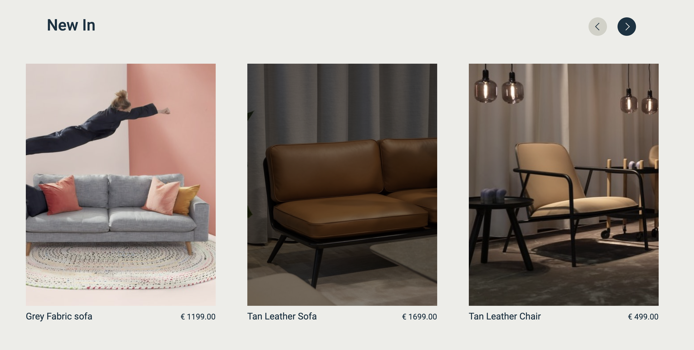</p>
            
        - The user can also select different categories from the navigation.

            - <p float="left"></p>

    - As a customer, I would like to be able to navigate the website easily.
        - The main navigation has items for, the cart, account and wishlist on show at all times.

            - <p float="left"></p>

        - The main navigation is then accessed by clicking the burger menu.
        - This shows the main navigation items.
        - At different points on the site, some buttons link back to shopping or the checkout, etc for the user's convenience.

            - <p float="left"></p>


    - As a customer, I would like to see some information about the company.
        - The homepage contains a small snippet of information about the company.
        - The hero image contains a link to our story page which then contains more detailed information about the company.

            - <p float="left"></p>


    - As a customer, I would like to be able to contact the company.
        - In the footer that is throughout the site there are the main contact details.
        - The user can also click on the contact us here link to be brought to the contact form.

            - <p float="left"></p>

  
  - Searching for items.

    - As a customer, I would like to see all the products the company sells.
        - On the homepage, shop collection buttons are linking to the all items page.
        - There is also a shop collection navigation link.

            - <p float="left"></p>

    - As a customer, I would like to be able to search by category.
        - The navigation menu contains a link for each category, and for the subcategories in the furniture section.
        - The user can click on these to shop for items in a particular category.

            - <p float="left"></p>

    - As a customer, I would like to be able to search through the items.
        - The navigation menu has a search form that the user can use to search through the sites stock.

            - <p float="left"></p>

    - As a customer, I would like to sort the items by price.
        - The all items page has a select input to allow the items to be sorted by price.

             - <p float="left"></p>


  - Shopping.

    - As a customer, I would like to see the product price and description.
        - Upon clicking on an item image the user is brought to the item page where the items price and description are shown.

             - <p float="left"></p>

    - As a customer, I would like to be able to add products to my shopping cart.
        - From the item page the user can click the add to cart button which will then add the item to the user's cart.

            - <p float="left"></p>

    - As a customer, I would like to be notified when I complete interactions with the site.
        - The user is notified with a popup message whenever they act on the site. 
        - The messages confirm actions as well as warnings and alerts.

            - eg Add to cart message.
            - <p float="left"></p>

    - As a customer, I would like to be able to edit my shopping cart.
        - From the cart page the user can alter the quantity or a particular item in their cart.
        - They can also delete an item if they wish to.

            - <p float="left"></p>

    - As a customer, I would like to be able to checkout easily.
        - Once the customer has an item in their cart they can then click on the checkout button to be taken to the checkout screen.
        - Once in the checkout the user then fills out a simple form and enters their card details.
        - Once this form is valid the checkout process will then be complete.

            - <p float="left"></p>

    - As a customer, I would like to receive confirmation of my order.
        - Once the user submits an order and it has been confirmed they will then be sent a confirmation email containing the order details.

         - <p float="left"></p>

  - Account.

    - As a customer, I would like to save my details to an account.
        - The user can click the save details button when checking out to save their details.
        - When the user signs up they can also save their details on the user profile page for future shopping.

            
            - Unlogged in user
            <p float="left"></p>

            - Logged in user.
             <p float="left"></p>


    - As a customer, I would like to see my previous order details.
        - On the user's profile page there is a list of the user's previous orders.
        - When the user clicks on an order number they will be brought to the previous order page with its details.

            - <p float="left"></p>


    - As a customer, I would like to leave a review of the company.
        - The user can navigate to the review page from the review section on the homepage
        - Here they can see all the user reviews and if they are logged in a review form.
        - Once they submit the review form and it's valid their review will appear in the list.

            - <p float="left"></p>

- Website owner.

  - As the business owner, I would like to be able to edit and add products easily.
    - The superuser can add products from the admin section of the site.
    - They also have access to the stock control page on the front end of the site.

        - <p float="left"></p>

    - The items page will also show buttons for them to edit or delete an item.

        - <p float="left"></p>


  - As the business owner, I would like to be able to delete products.

    - The items section will show buttons for the superuser to delete products.
    - A modal will ask them to confirm the deletion to prevent accidental deletion.

        - <p float="left"></p>

  - As the business owner, I would like to have access to an admin section. 
     - The admin superuser has access to the admin section where they can edit and add details to the database.
     - They also will receive customer messages here.

        - <p float="left"></p>

  - As the business owner, I would like my customers to be able to shop on the site easily.
    - The site has been built with the user in mind to allow ease of flow for shopping and navigating the site.


## Unit Testing

- ### Django Unit Testing   

    - Each app was tested using Django unit testing.
    - Tests were written to test the URLs, Models, Forms, and the Views.
    - To run the tests in the terminal you can type the following command
    -
        ```
            python3 manage.py test
        ```
    - To show how much of the app has been covered by the testing I used coverage.
    - To use coverage first run
    - ```
        pip install coverage
      ```
    - The run to test the whole app.
    - ```
        coverage run --source=. manage.py test
      ```
    - Or to test individual apps.
    - ```
        coverage run --source=abode manage.py test <app name>
      ```
    - Coverage generates a report to show how much of the code has been tested and how much is yet to be tested.
    - ```
        coverage report
      ```
    - You can then run coverage HTML to show the report on the screen.
    - ```
        coverage html
      ```    
    - To open the report you can run 
    - ```
            python3 -m http.server
      ```
    - I've included the reports for each app below.

        - 
            <div float="left"></div>
            <div float="left"></div>
            <div float="left"></div>


## Test and Bugs During Development

- #### Posting Data in the Cart App.
    - During Development I had an issue sending the post data while using stripe as I had decided to use vanilla javascript instead of jQuery.
    - When I was sending the data the CSRF token wasn't working.
    - I researched the issue and on stack overflow found the following solution which fixed the issue by placing 
    - By using the Headers key with X-CSRFTToken 
    -
        ``` javascript
            fetch(url, {
                method: "POST",
                headers: {
                    "X-CSRFToken": csrfToken
                },
        ```

- #### Moving Fetch function into its own file.
    - I had an issue when I moved my javascript into its own file when it was using the fetch function with the csrfToken.
    - I then found that declaring the csrfToken variable in a script tag on the HTML page before importing the javascript file fixed the issue
    - 
        ``` html
            <script>
                let csrfToken = "{{ csrf_token }}";
            </script>
            <script src=""></script>
        ```


- #### Post Data in the Stripe js
    - During developing the javascript for stripe I had an issue with posting the data.
    - When I declared my data into a dictionary and tried to post it, it would work properly.
    - Through researching the issue I found that using the FormData constructor fixed the issue.
    - Once this was done the code then sent the data to the cache_checkout_data view.
    - 
        ``` javascript
                let csrfToken = document.querySelector('[name="csrfmiddlewaretoken"]').value
                let postData = new FormData()
                postData.set("csrfmiddlewaretoken", csrfToken)
                postData.set("client_secret", clientSecret)
                postData.set("save_info", saveInfo)
                let url = "/checkout/cache_checkout_data/";
            // stack overflow  code to help with the fetch and CSRF tokens
                fetch(url, {
                    method: "POST",
                    headers: {
                        "X-CSRFToken": csrfToken,
                    },
                    body: postData
                }).then(() => {
                    // rest of code 
        ```
    
- #### Blue background in forms on google chrome.
    - When I was testing my forms I noticed on google chrome they had a blue background colour that didn't sit well with the website design.
    - To fix this issue I researched and found it was styling that google chrome was applying to the forms.
    - I found code on StackOverflow to fix this.
    - By placing the following into my base CSS.
    - 
        ``` css
            /* code from stack overflow to stop my inputs 
            turning a light blue when filled in */
            input:-webkit-autofill,
            input:-webkit-autofill:hover,
            input:-webkit-autofill:focus textarea:-webkit-autofill,
            textarea:-webkit-autofill:hover textarea:-webkit-autofill:focus,
            select:-webkit-autofill,
            select:-webkit-autofill:hover,
            select:-webkit-autofill:focus {
                -webkit-box-shadow: 0 0 0px 1000px #EDEDE9 inset !important;
                box-shadow: 0 0 0px 1000px #EDEDE9 inset !important;
            }
                input:-webkit-autofill {
                    -webkit-text-fill-color: #153243 !important;
                }
        ```

- #### Error With Decimal Fields.
    - During the Development I noticed an issue with some of my items during the checkout.
    - I researched the issue and then figured out I had set my decimal fields too low in the models and as It was a furniture store and prices were higher they were causing an error.
    - I used the following page from stack overflow to fix this issue.
        - [Django Error class decimal](https://stackoverflow.com/questions/56458774/django-error-class-decimal-invalidoperation)


## Defensive Programming and Security

- Security
    - Environmental variables
        - For security reasons I have followed standard practices and used os to declare the environmental variables for any sensitive information.
        - For Development, these variables are declared in the settings section of gitpod.
        - In doing this it means that sensitive information such as passwords and secret keys aren't put in a public place.
        - To deploy on Heroku these environmental variables are also placed into the settings, config variables section.

    - Users passwords.
        - I have used Django all auth to handle the user's login and signup.
        - This stores the users pass as a hashed key for security.
        - It also makes the users confirm their emails as an extra security step.
    
    - ### Defensive Programming.
        
        - I have used code in my project to make sure actions cannot occur by placing URLs into the browser. 

        - If for instance the user types in the URL to delete a post the application has been programmed to redirect the user elsewhere and show an error message. 

        - I have tested this by typing the URLs into the browser it has worked as expected

        - I have also placed a confirmation modal to check if a user is sure they want to delete anything on the site such as, deleting the entire wishlist, or deleting a stock item for the superusers.
        
        - This will minimize the user deleting things by mistake.

## Manual Testing

- All functionality of the website was also tested manually to ensure it all worked correctly

    - #### Cart Functionality.

        - To test the cart functionality I first added an item to the cart.
            - <p float="left"></p>
        
        - I then navigated to the cart page and updated the item amount to test 
        this function.
            - <p float="left"></p>

        - I then removed the item to test this functionality out.
            - <p float="left"></p>

    - #### Checkout Functionality

        - To test the checkout functionality I first placed an item into my cart and then navigated to the checkout page. 
        - I then filled in the checkout form using the stripe test credit card number.
        - I then received an order confirmation.
            - <p float="left"></p>

        - I then checked my email for the order confirmation email.
            - <p float="left"></p>

        - Then I checked stripe to insure all payment intents had succeeded.
            - <p float="left"></p>

        - Finally, I checked the admin to ensure the order had been placed.
            - <p float="left"></p>

    - #### Stock control

        - To test the stock control functionality I first logged in as the admin user.
        - I then navigated to the stock control page and created a new item. 
            - <p float="left">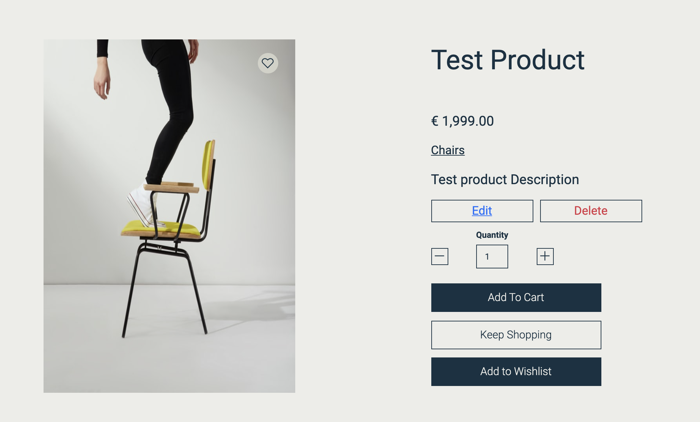</p>

        - I then tested editing the item.
            - <p float="left"></p>

        - Then finally I tested deleting the item.
            - <p float="left">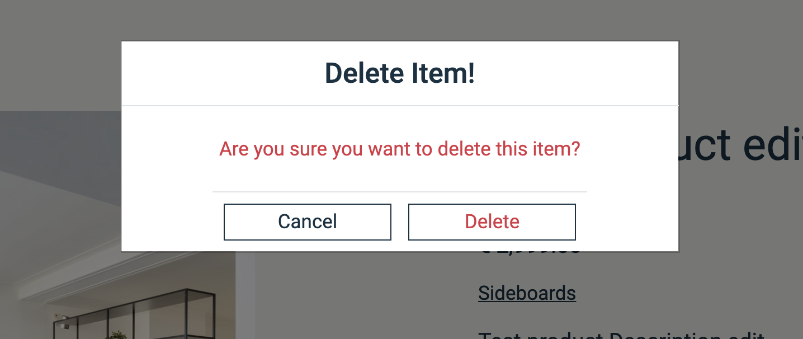</p>
            - <p float="left">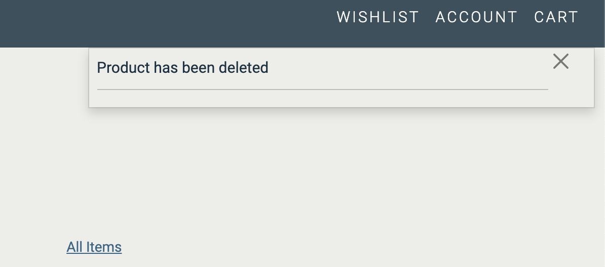</p>
    
    - #### Reviews Functionality.
        - To test the review functionality I first logged in to my account.
        - I then navigated to the review page where I submitted a review.
            - <p float="left">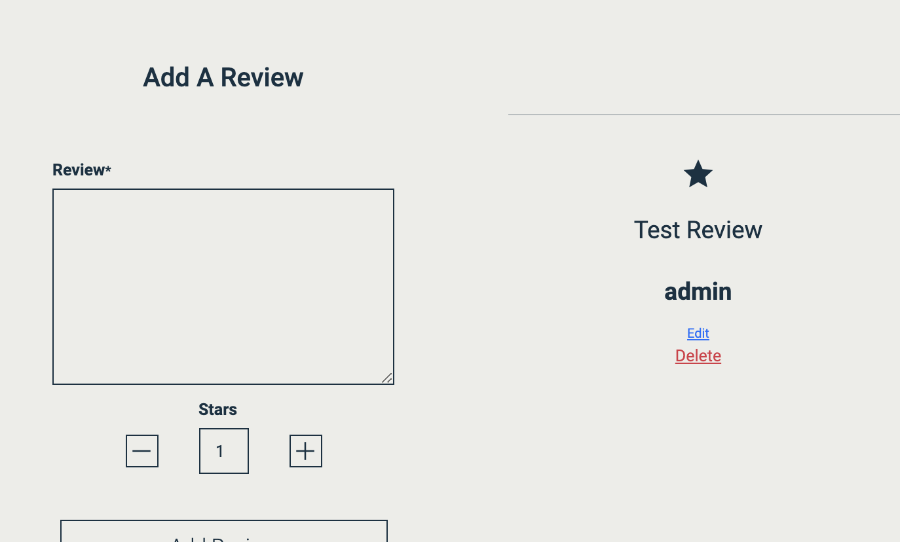</p>

        - Once the review was there I then edited the review.
            - <p float="left">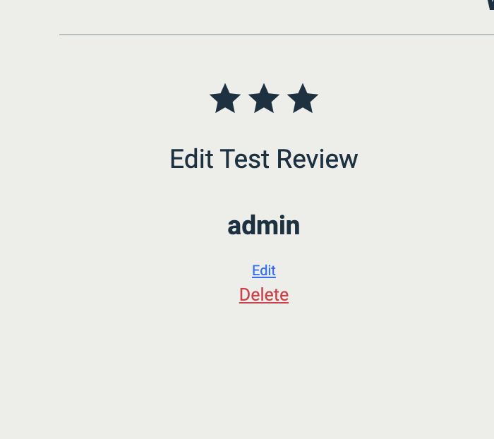</p>

        - I then deleted the review to test the delete functionality.
            - <p float="left">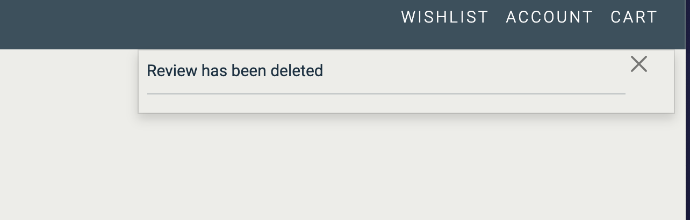</p>
    
    - #### Blog Functionality
        - To test the blog functionality I first logged in as the admin user.
        - I then created a new blog post.
            - <p float="left">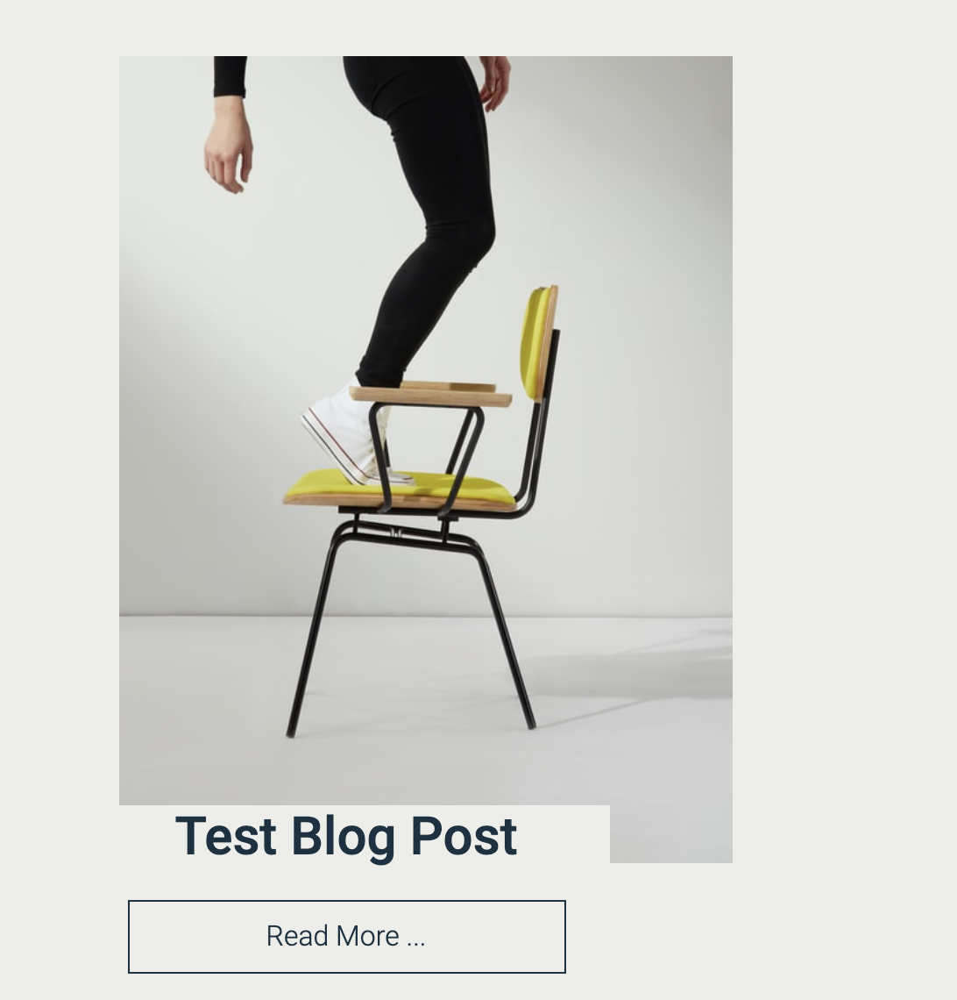</p>

        - I then tested editing the blog post.
            - <p float="left">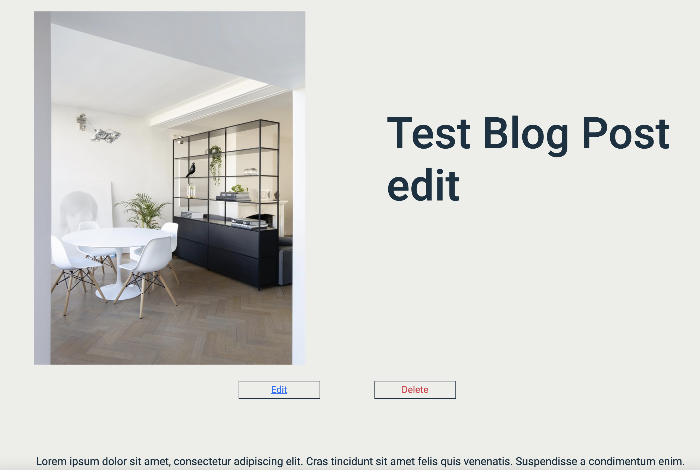</p>
        - I also tested commenting on the blog post.
            - <p float="left">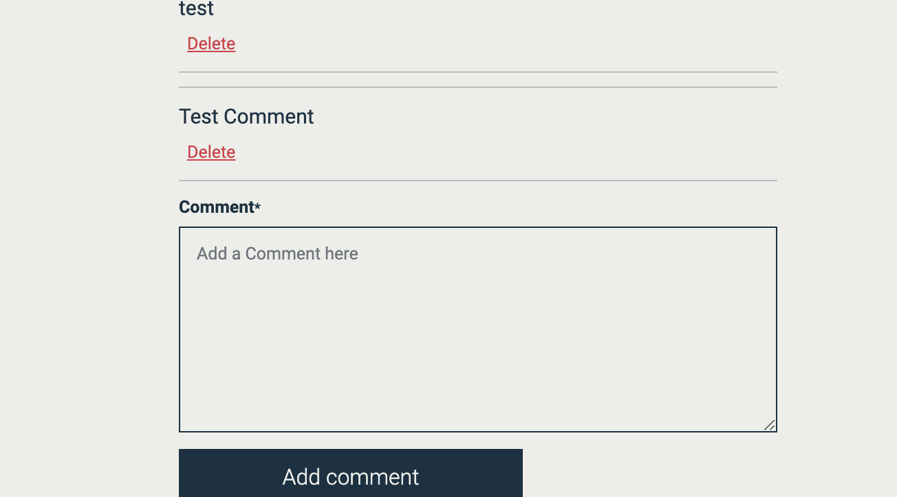</p>

        - Then I tested deleting the blog post and comments.
            - <p float="left">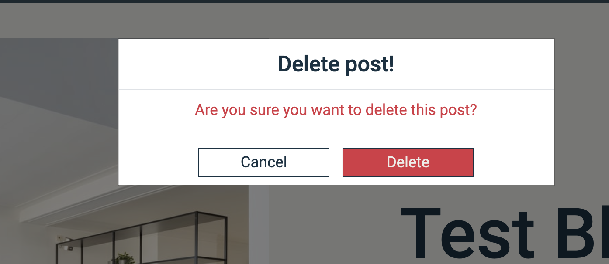</p>
    
    - #### Wishlist Functionality
        - To test the wishlist functionality I first logged into my account.
        - I then tested the add to wishlist button on the image. 
            - <p float="left">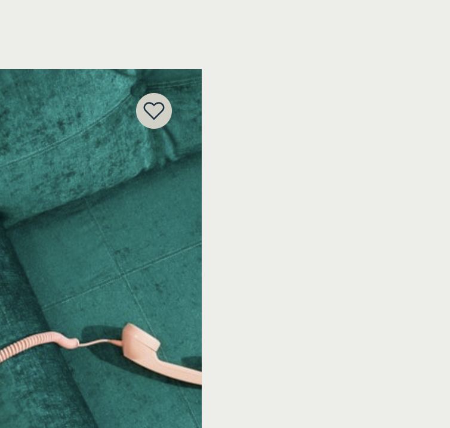</p>

        - I also tested the add to wishlist button on the item page.
            - <p float="left">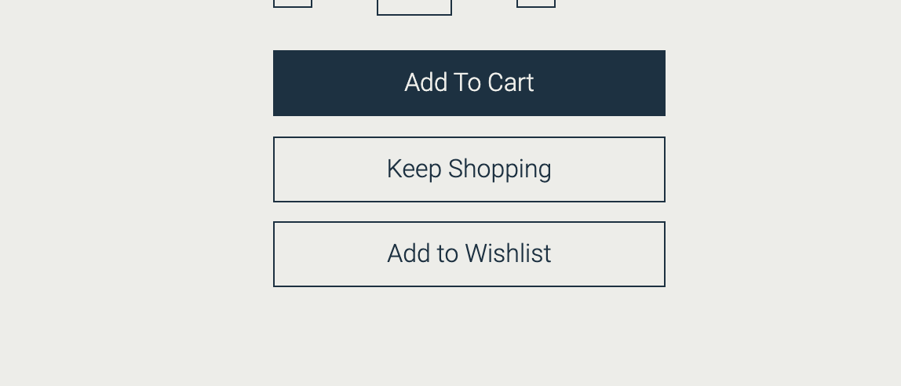</p>

        - I then tested the item that has been placed on the wishlist. 
        - I then tested the edit wishlist button.
        - Finally, I tested the delete wishlist button.
            - <p float="left">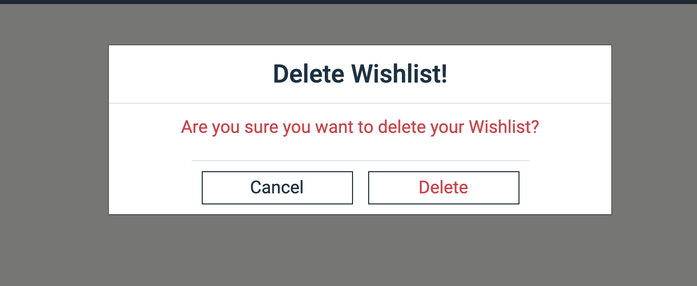</p>
            - <p float="left">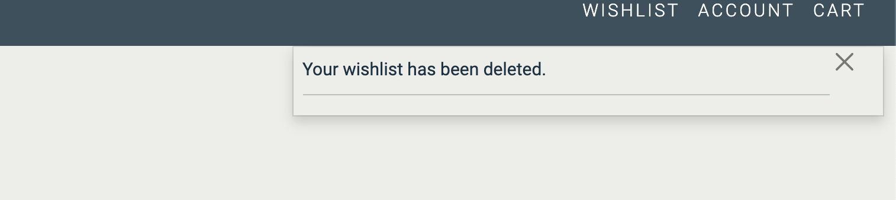</p>
    
    - #### Newsletter Sign up
        - To test the newsletter signup I entered my email and submitted the form.
            - <p float="left">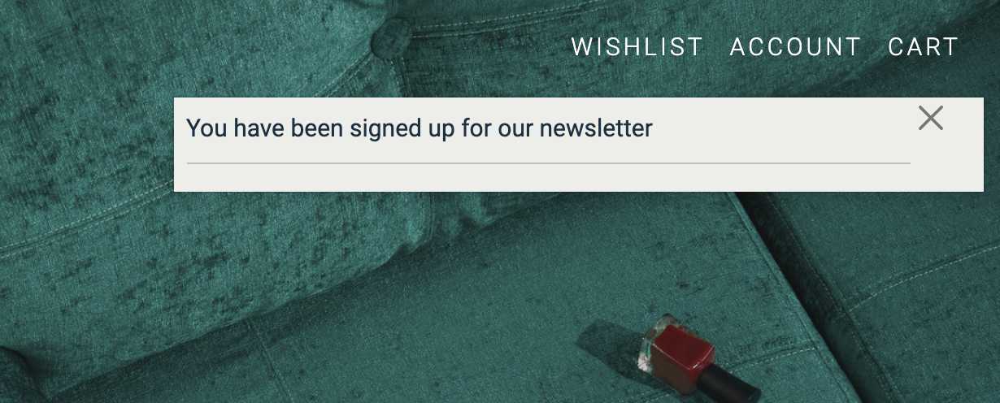</p>
            - <p float="left">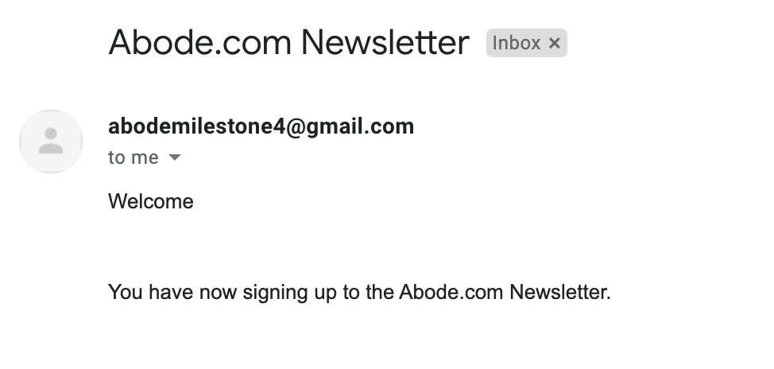</p>
    
    - #### Contact Form
        - To test the contact form I navigated to the contact page from the footer.
        - I then filled in and submitted the form. 
        - I then logged into the admin to check to see if my contact message had been sent
            - <p float="left">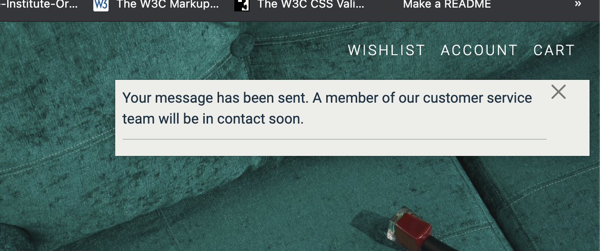</p>
            - <p float="left">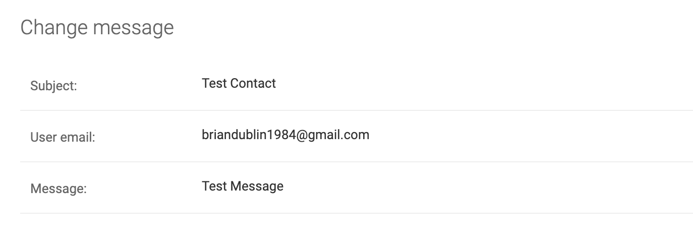</p>
    
    - #### Forms 
        - All forms have been check to see if the throw and error if they are left empty when the field is required.
        - They have also been check by putting in incorrect inputs to check if they show an error to the user. 
            - <p float="left">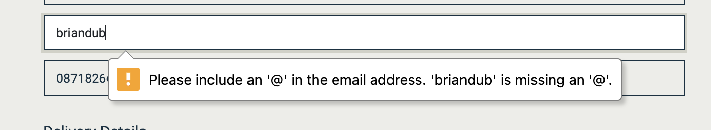</p>
    
    - #### Facebook Login.
        - I have tested the Facebook login by login into the website using my own Facebook account.
        - The functionality has worked as expected.
           


## Validators

- #### CSS
    - I passed my CSS through the CSS code validator and it has passesd.

        - <div float="left">
            
        </div>

- #### Javascript

     - My javascript was passed thorough jshint.

     - <div float="left">
        
        </div>

- #### Python

     - My python was passed through a pep8 validating tool to validate it and it all passed.

     - <div float="left">
        
        </div>

- #### Html

     - My Html code was passed through the W3C Markup Validation Service and there are no errors showing.

     - <div float="left">
        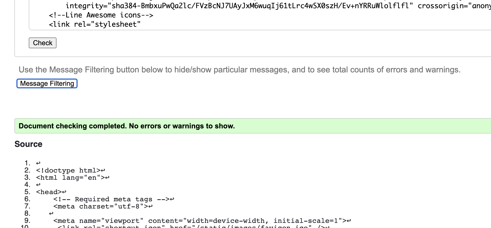
        </div>

## Responsiveness and Browsers

- I have tested the site Responsivenessacross Google chrome dev tools. 
- I have also used the application across different screen sizes.
- The app has also been used on different browsers to check its compatibility
    - Google chrome.
    - Safari
    - Opera
    - Microsoft edge
    - Firefox.

## Accessibility

- The site has been tested for Accessibility using google lighthouse and the Accessibility insights chrome extension.
- When testing I made several changes to heading elements to improve the Accessibility.
- I have also ensured that all images have alt text attributes.
- All icons have been aria-labelled and include text descriptions for screenreaders only.
- Upon testing in lighthouse, I have received scores of 98% to 100% across the site.